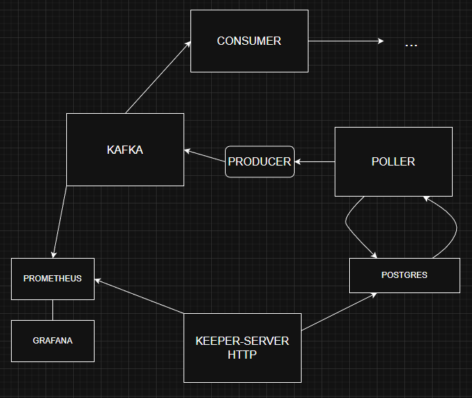

# events_on-the-way
Представляет собой систему по отправке событий через Kafka, хранящихся в базе, пришедших keeper'у по http.

 .

Отправка событий (**producer**) происходят **идемпотентно** и способом **exactly once**:
```sh
config.Producer.RequiredAcks = sarama.WaitForAll
config.Producer.Idempotent = true
```

Poller проверяет БД каждые 5 секунд на наличие событий со статусом NEW и отдает продюсеру.
```sh
SELECT event_id, trip_id, driver_id, trip_position, trip_destination
FROM outbox
WHERE event_status='NEW'
ORDER BY created_at
LIMIT $1
FOR UPDATE SKIP LOCKED
```

Происходит отправка метрик в **prometheus**.